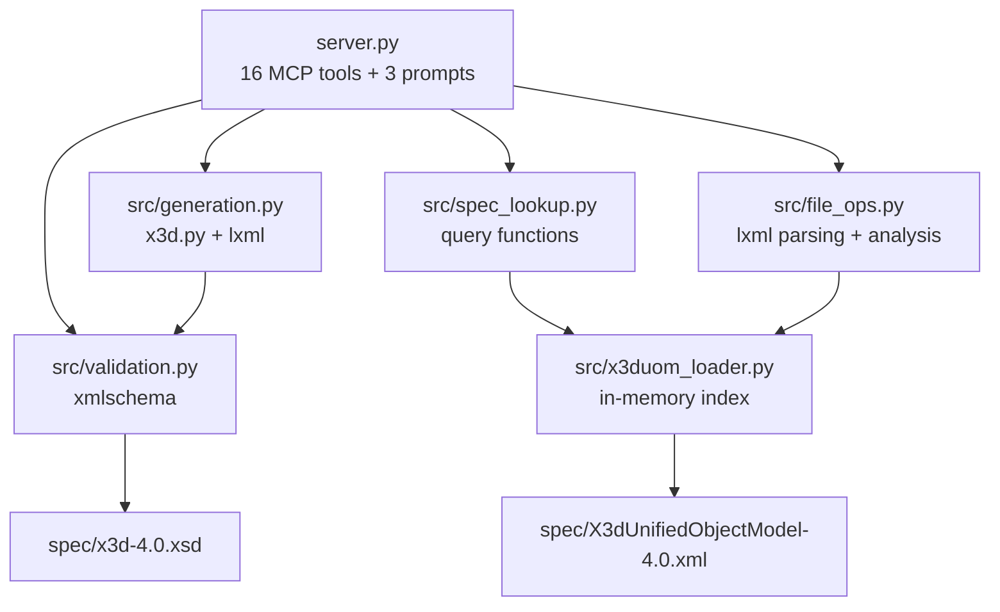

# x3d-mcp

An MCP server that gives AI models the ability to validate, look up, generate, analyze, and render [X3D](https://www.web3d.org/x3d/what-x3d) content.

X3D (Extensible 3D Graphics) is the ISO standard (ISO/IEC 19775) for representing 3D scenes and objects in XML. The [Model Context Protocol](https://modelcontextprotocol.io) (MCP) is a standard that lets AI models call external tools. This server bridges the two: it exposes 16 tools and 3 workflow prompts that let an AI work with X3D using authoritative spec data rather than training-data guesses, produce schema-valid output, and render it in a browser.

## Features

- **Validation** -- Validate X3D content against the official X3D 4.0 XML Schema (26,000+ line XSD), catching invalid nodes, wrong attribute types, and hierarchy violations
- **Spec Lookup** -- Query the full X3D Unified Object Model: 200+ concrete nodes, field types with constraints, inheritance chains, component/profile browsing, and parent-child hierarchy checking
- **Scene Generation** -- Programmatically create X3D content via the official x3d.py library (X3DPSAIL), manipulate scenes with targeted node insertion, and convert to standalone X3DOM HTML pages for browser rendering
- **File Operations** -- Parse existing X3D scenes into readable tree views, get node statistics by type and component, list all named (DEF'd) nodes, and extract specific node subtrees
- **Guided Workflows** -- MCP prompts for common multi-step tasks: building a scene from scratch, auditing an existing file, and converting to X3DOM

## Quickstart

**Prerequisites:** Python 3.12+, [uv](https://docs.astral.sh/uv/)

```bash
git clone <repo-url>
cd x3d-mcp
uv sync
```

The server uses stdio transport and is designed to be launched by an MCP client (see configuration below), not run standalone. To verify it starts correctly:

```bash
uv run python server.py
```

### MCP Inspector

You can test the server interactively using the MCP Inspector, which is bundled with the `mcp[cli]` dependency:

```bash
uv run mcp dev server.py
```

This opens a web UI where you can call each tool, see input schemas, and inspect responses.

## MCP Client Configuration

### Claude Desktop

Add to your `claude_desktop_config.json`:

```json
{
  "mcpServers": {
    "x3d": {
      "command": "uv",
      "args": ["run", "python", "server.py"],
      "cwd": "/absolute/path/to/x3d-mcp"
    }
  }
}
```

### Cursor

Add to `.cursor/mcp.json` in your project root. Use `uv run --directory` to point at the x3d-mcp project (this is more reliable than `cwd`, especially with paths containing spaces):

```json
{
  "mcpServers": {
    "x3d": {
      "command": "uv",
      "args": ["run", "--directory", "/absolute/path/to/x3d-mcp", "python", "server.py"]
    }
  }
}
```

Replace `/absolute/path/to/x3d-mcp` with the actual path to this repository. If Cursor can't find `uv`, use the full path (e.g., `/opt/homebrew/bin/uv` on macOS).

## Tools

### Validation

| Tool | Parameters | Description |
|------|-----------|-------------|
| `validate_x3d` | `x3d_xml` (string) | Validate an X3D XML string against the X3D 4.0 schema |
| `validate_x3d_file_tool` | `filepath` (string) | Validate a `.x3d` file on disk |

### Spec Lookup

| Tool | Parameters | Description |
|------|-----------|-------------|
| `x3d_node_info` | `node_name` (string) | Get full spec info for a node: fields, types, defaults, constraints, inheritance |
| `x3d_search_nodes` | `query` (string) | Search nodes by name or description |
| `x3d_list_components` | `component_name` (string, optional) | List all components, or all nodes in a specific component |
| `x3d_list_profiles` | -- | List all X3D profiles with descriptions |
| `x3d_field_type_info` | `field_type` (string) | Explain a field type (e.g. `SFVec3f`) or enumeration type |
| `x3d_check_hierarchy` | `parent_node`, `child_node` (strings) | Check if a parent-child node relationship is valid |

### Scene Generation

| Tool | Parameters | Description |
|------|-----------|-------------|
| `x3d_scene_template` | `profile`, `title`, `include_viewpoint`, `include_light` | Generate a complete, valid X3D scene template |
| `x3d_generate_node` | `node_name`, `fields` (JSON string) | Generate a single X3D node XML fragment |
| `x3d_add_node` | `scene_xml`, `node_xml`, `parent_def` | Insert a node into an existing scene |
| `x3dom_page` | `x3d_content`, `title`, `width`, `height`, `show_stats`, `show_log` | Wrap X3D content in a standalone X3DOM HTML page |
| `x3dom_starter` | -- | Generate a ready-to-open X3DOM page with an example scene |

### File Operations

| Tool | Parameters | Description |
|------|-----------|-------------|
| `x3d_parse_scene` | `x3d_source` (file path or XML string) | Parse and display the scene graph as an indented tree |
| `x3d_scene_stats` | `x3d_source` | Get statistics: node counts by type and X3D component |
| `x3d_list_defs` | `x3d_source` | List all DEF'd (named) nodes with parent/children context |
| `x3d_extract_node` | `x3d_source`, `def_name`, `node_type`, `index` | Extract a specific node subtree as XML |

### Prompts

| Prompt | Parameters | Description |
|--------|-----------|-------------|
| `build_scene` | `description` (optional) | Step-by-step guide to build an X3D scene from scratch |
| `audit_scene` | `filepath` (optional) | Guide to analyze and audit an existing X3D file |
| `convert_to_x3dom` | -- | Guide to convert X3D content into a browser-viewable HTML page |

## Common Workflows

### Build a 3D scene

```
1. x3d_scene_template(profile="Interchange", title="My Scene")
2. x3d_node_info("Sphere")                          -- check available fields
3. x3d_generate_node("Sphere", '{"radius": 2.5}')   -- create geometry
4. x3d_add_node(scene_xml, node_xml)                 -- insert into scene
5. validate_x3d(scene_xml)                           -- verify against schema
6. x3dom_page(scene_xml, title="My Scene")           -- render in browser
```

### Audit an existing X3D file

```
1. x3d_parse_scene("/path/to/model.x3d")   -- see the scene graph tree
2. x3d_scene_stats("/path/to/model.x3d")   -- get node counts by type/component
3. x3d_list_defs("/path/to/model.x3d")     -- list all named nodes
4. validate_x3d_file_tool("/path/to/model.x3d")  -- check schema compliance
5. x3d_extract_node("/path/to/model.x3d", def_name="SomeNode")  -- inspect specific nodes
```

### Example: X3D input/output

A minimal X3D scene with a red sphere:

```xml
<?xml version="1.0" encoding="UTF-8"?>
<X3D profile="Interchange" version="4.0">
  <Scene>
    <Viewpoint description="Front" position="0 0 10"/>
    <Shape>
      <Appearance>
        <Material diffuseColor="1 0 0"/>
      </Appearance>
      <Sphere radius="2"/>
    </Shape>
  </Scene>
</X3D>
```

Key X3D patterns:
- **Shape** = Appearance (Material + optional Texture) + Geometry (Box, Sphere, Cylinder, etc.)
- **Transform** wraps children with translation, rotation, and scale
- **DEF/USE** names let you define a node once and reuse it
- **SFColor** is 3 floats in [0,1] range (e.g., `1 0 0` = red)
- **SFRotation** is axis-angle: `x y z angle_in_radians`

## Architecture



| File | Role |
|------|------|
| `server.py` | MCP entry point. Registers all 16 tools and 3 prompts with `FastMCP` and runs the stdio transport. |
| `src/validation.py` | Loads the X3D 4.0 XSD via `xmlschema`, strips namespace/DOCTYPE processing instructions, and validates XML strings or files. |
| `src/x3duom_loader.py` | Parses the 43,000-line X3DUOM XML into in-memory dictionaries. Resolves full inheritance chains to collect all fields for any node. Singleton via `lru_cache`. |
| `src/spec_lookup.py` | Query layer over the X3DUOM index: node info, search, component/profile listing, field type documentation, hierarchy checking with inheritance-aware type matching. |
| `src/generation.py` | Constructs X3D nodes via the official x3d.py (X3DPSAIL) library, manipulates scene trees with lxml, and converts X3D XML to X3DOM-compatible HTML (lowercase tags, explicit closing tags, namespace stripping). |
| `src/file_ops.py` | Reads and analyzes existing X3D content: scene graph tree view, statistics by type/component, DEF node listing, and node extraction by DEF name or type+index. |
| `spec/` | Bundled official spec files: X3D 4.0 XSD (with Web3D extension schemas) and the X3D Unified Object Model XML. |

## Development

Install all dependencies including dev tools:

```bash
uv sync --group dev
```

Run the test suite:

```bash
uv run pytest
```

There are currently 101 tests across four test files:

| Test file | Count | Covers |
|-----------|-------|--------|
| `tests/test_validation.py` | 9 | Schema validation of valid/invalid documents, XSI attribute stripping, file handling, edge cases |
| `tests/test_spec_lookup.py` | 24 | X3DUOM loading, node info, search, components, profiles, field types, hierarchy checking |
| `tests/test_generation.py` | 32 | Scene templates, node generation, scene manipulation, X3DOM page output, HTML escaping |
| `tests/test_file_ops.py` | 36 | Scene parsing, statistics, DEF listing, node extraction, file path handling |

### Adding a New Tool

1. Implement the function in the appropriate `src/` module
2. Register it in `server.py` with the `@mcp.tool()` decorator
3. Write a detailed docstring -- the AI model sees this as the tool description
4. Add tests in the corresponding `tests/test_*.py` file
